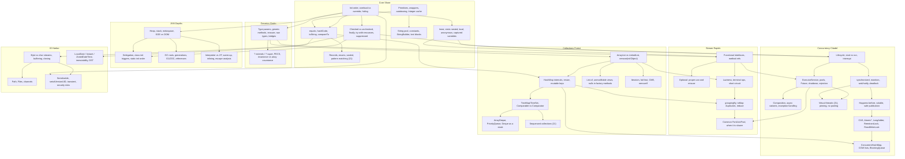

# Topic map

Generated from `content/` by `./gradlew generateTopicMap`. Do not edit by hand.

```mermaid
flowchart TD
    subgraph core_2d_shore["Core Shore"]
        core_2e_oop["Init order, overload vs override, hiding"]
        core_2e_types["Primitives, wrappers, autoboxing, Integer cache"]
        core_2e_exceptions["Checked vs unchecked, finally, try-with-resources, suppressed"]
        core_2e_nested_2d_classes["Inner, static nested, local, anonymous, captured variables"]
        core_2e_object_2d_contract["equals, hashCode, toString, compareTo"]
        core_2e_strings["String pool, constants, StringBuilder, text blocks"]
        core_2e_modern_2d_types["Records, enums, sealed, pattern matching (21)"]
    end
    subgraph generics_2d_grotto["Generics Grotto"]
        generics_2e_basics["Type params, generic methods, erasure, raw types, bridges"]
        generics_2e_wildcards["? extends / ? super, PECS, invariance vs array covariance"]
    end
    subgraph collections_2d_forest["Collections Forest"]
        collections_2e_lists["ArrayList vs LinkedList, remove(int/Object)"]
        collections_2e_hashing["HashMap internals, resize, mutable keys"]
        collections_2e_immutable["List.of, unmodifiable views, nulls in factory methods"]
        collections_2e_iteration["Iterators, fail-fast, CME, removeIf"]
        collections_2e_sorted["TreeMap/TreeSet, Comparable vs Comparator"]
        collections_2e_queues["ArrayDeque, PriorityQueue, Deque as a stack"]
        collections_2e_sequenced["Sequenced collections (21)"]
    end
    subgraph stream_2d_rapids["Stream Rapids"]
        functional_2e_lambdas["Functional interfaces, method refs"]
        functional_2e_optional["Optional: proper use and misuse"]
        functional_2e_streams["Laziness, terminal ops, short-circuit"]
        functional_2e_collectors["groupingBy, toMap duplicates, reduce"]
        functional_2e_parallel_2d_streams["Common ForkJoinPool, when it is slower"]
    end
    subgraph concurrency_2d_citadel["Concurrency Citadel"]
        conc_2e_threads["Lifecycle, start vs run, interrupt"]
        conc_2e_executors["ExecutorService, pools, Future, shutdown, rejection"]
        conc_2e_synchronization["synchronized, monitors, wait/notify, deadlock"]
        conc_2e_completable_2d_future["Composition, async variants, exception handling"]
        conc_2e_jmm["Happens-before, volatile, safe publication"]
        conc_2e_virtual_2d_threads["Virtual threads (21), pinning, no pooling"]
        conc_2e_atomics_2d_locks["CAS, Atomic*, LongAdder, ReentrantLock, ReadWriteLock"]
        conc_2e_concurrent_2d_collections["ConcurrentHashMap, COW lists, BlockingQueue"]
    end
    subgraph jvm_2d_depths["JVM Depths"]
        jvm_2e_memory["Heap, stack, metaspace, SOE vs OOM"]
        jvm_2e_classloading["Delegation, class init triggers, static init order"]
        jvm_2e_gc["GC roots, generations, G1/ZGC, references"]
        jvm_2e_jit["Interpreter vs JIT, warm-up, inlining, escape analysis"]
    end
    subgraph io_2d_harbor["IO Harbor"]
        io_2e_streams["Byte vs char streams, buffering, closing"]
        time_2e_java_2d_time["LocalDate / Instant / ZonedDateTime, immutability, DST"]
        io_2e_nio2["Path, Files, channels"]
        io_2e_serialization["Serializable, serialVersionUID, transient, security risks"]
    end
    core_2e_oop --> core_2e_exceptions
    core_2e_oop --> core_2e_nested_2d_classes
    core_2e_oop --> core_2e_object_2d_contract
    core_2e_types --> core_2e_object_2d_contract
    core_2e_types --> core_2e_strings
    core_2e_oop --> generics_2e_basics
    core_2e_oop --> jvm_2e_memory
    generics_2e_basics --> collections_2e_lists
    core_2e_exceptions --> conc_2e_threads
    core_2e_nested_2d_classes --> conc_2e_threads
    core_2e_object_2d_contract --> core_2e_modern_2d_types
    core_2e_nested_2d_classes --> functional_2e_lambdas
    generics_2e_basics --> functional_2e_lambdas
    generics_2e_basics --> generics_2e_wildcards
    core_2e_exceptions --> io_2e_streams
    jvm_2e_memory --> jvm_2e_classloading
    core_2e_exceptions --> jvm_2e_classloading
    jvm_2e_memory --> jvm_2e_gc
    jvm_2e_memory --> jvm_2e_jit
    core_2e_object_2d_contract --> time_2e_java_2d_time
    collections_2e_lists --> collections_2e_hashing
    core_2e_object_2d_contract --> collections_2e_hashing
    collections_2e_lists --> collections_2e_immutable
    collections_2e_lists --> collections_2e_iteration
    conc_2e_threads --> conc_2e_executors
    functional_2e_lambdas --> conc_2e_executors
    conc_2e_threads --> conc_2e_synchronization
    functional_2e_lambdas --> functional_2e_optional
    functional_2e_lambdas --> functional_2e_streams
    collections_2e_lists --> functional_2e_streams
    io_2e_streams --> io_2e_nio2
    io_2e_streams --> io_2e_serialization
    core_2e_oop --> io_2e_serialization
    collections_2e_hashing --> collections_2e_sorted
    conc_2e_executors --> conc_2e_completable_2d_future
    conc_2e_synchronization --> conc_2e_jmm
    conc_2e_executors --> conc_2e_virtual_2d_threads
    conc_2e_synchronization --> conc_2e_virtual_2d_threads
    functional_2e_streams --> functional_2e_collectors
    collections_2e_hashing --> functional_2e_collectors
    collections_2e_sorted --> collections_2e_queues
    collections_2e_sorted --> collections_2e_sequenced
    conc_2e_jmm --> conc_2e_atomics_2d_locks
    functional_2e_collectors --> functional_2e_parallel_2d_streams
    conc_2e_executors --> functional_2e_parallel_2d_streams
    conc_2e_atomics_2d_locks --> conc_2e_concurrent_2d_collections
    collections_2e_hashing --> conc_2e_concurrent_2d_collections
```
